# RailSahayak: The Station Ecosystem Platform

> **"The Uber for Porters, Zomato for Station Food, and Waze for Platform Intelligence."**

RailSahayak is a hyperlocal web application designed to solve the "Last Mile" chaos of Indian Railway stations. While IRCTC handles ticketing, RailSahayak manages the physical experience—booking coolies, finding medical help, ordering food to your seat, and crowdsourcing platform issues in real-time.

---

## Key Features

### 1. Live Train & Platform Intelligence
- **Hybrid Tracking Engine:** Uses a mix of Real-time APIs and a sophisticated simulation engine to track train speed, location, and delays.
- **Coach Position:** Visual indicator of where your coach will arrive on the platform.
- **Destination Alarm:** Geofenced wake-up alarm that alerts you 20km before your stop.

### 2. Service Booking (Uber for Stations)
- **Coolie Booking:** Pre-book porters with fixed pricing based on luggage weight.
- **Wheelchair Assistance:** Request mobility support for seniors and PwD.
- **Cloak Room:** Check real-time locker availability.

### 3. Hyperlocal Food Delivery
- **Dynamic Menu:** Orders are accepted only if the "Kitchen Prep Time" < "Train Arrival Time".
- **Live Receipt:** Generates detailed digital invoices saved to the cloud.
- **Cart Logic:** Prevents ordering from high-risk restaurants if the train is departing soon.

### 4. RailMed (Doctor on Board)
- **Manifest Scanning:** Simulates scanning the passenger chart to locate registered doctors travelling on the *same train*.
- **Emergency Access:** One-tap request for medical assistance.

### 5. Community Intel (Waze for Stations)
- **Crowdsourced Issues:** Users report broken lifts, dirty toilets, or crowds.
- **Gamification:** Earn "Karma Points" and rank up (Scout → Guardian → Legend) by helping others.
- **AI Analysis:** Google Gemini analyzes reports to categorize severity automatically.

### 6. AI Assistant (Bolo Sahayak)
- **Voice-First:** Click the mic to speak PNRs or ask questions in Hindi/English.
- **Gemini Powered:** Context-aware chatbot for station queries.

---

## Tech Stack

- **Frontend:** React 18, TypeScript, Tailwind CSS
- **Styling:** Dark/Light Mode with Slate palette
- **Authentication:** Firebase Auth (Google, Email/Password)
- **Database:** Firebase Firestore (Real-time NoSQL)
- **AI/LLM:** Google Gemini API (Multimodal generation)
- **APIs:** RailRadar OpenAPI (Integration ready)

---

## System Architecture & Flow Diagrams

### 1. High-Level Architecture


### 2. Food Ordering Logic Flow

```mermaid
sequenceDiagram
    participant User
    participant App
    participant DB as Firestore
    
    User->>App: Select Food Item
    App->>App: Check Prep Time vs Train Arrival
    alt Time Insufficient
        App-->>User: ⚠️ High Risk Warning
    else Time OK
        App->>User: Add to Cart
    end
    
    User->>App: Checkout
    App->>DB: Create Order {status: PENDING}
    DB-->>App: Order ID Generated
    App-->>User: Show Digital Receipt
```


### 3. Community Intelligence (Waze Logic)


---

## Installation & Setup

1. **Clone the repository**
   ```bash
   git clone https://github.com/yourusername/railsahayak.git
   cd railsahayak
   ```

2. **Install Dependencies**
   ```bash
   npm install
   ```

3. **Configure Environment**
   Update `firebaseConfig.ts` with your credentials:
   ```typescript
   // src/firebaseConfig.ts
   const firebaseConfig = {
     apiKey: "YOUR_FIREBASE_KEY",
     authDomain: "your-app.firebaseapp.com",
     projectId: "your-project-id",
     // ... other keys
   };
   ```

4. **Run Locally**
   ```bash
   npm run dev
   ```

---

## 🔮 Future Roadmap

- [ ] **PNR Sharing:** Auto-group passengers travelling on the same train.
- [ ] **Offline Maps:** Download station layouts for offline navigation.
- [ ] **AR Navigation:** Augmented Reality pathfinding to finding coaches.
- [ ] **Hardware Integration:** IoT beacons on platforms for precise location.

---

##  Contributing

Contributions are welcome! Please open an issue or submit a pull request for any features or bug fixes.
